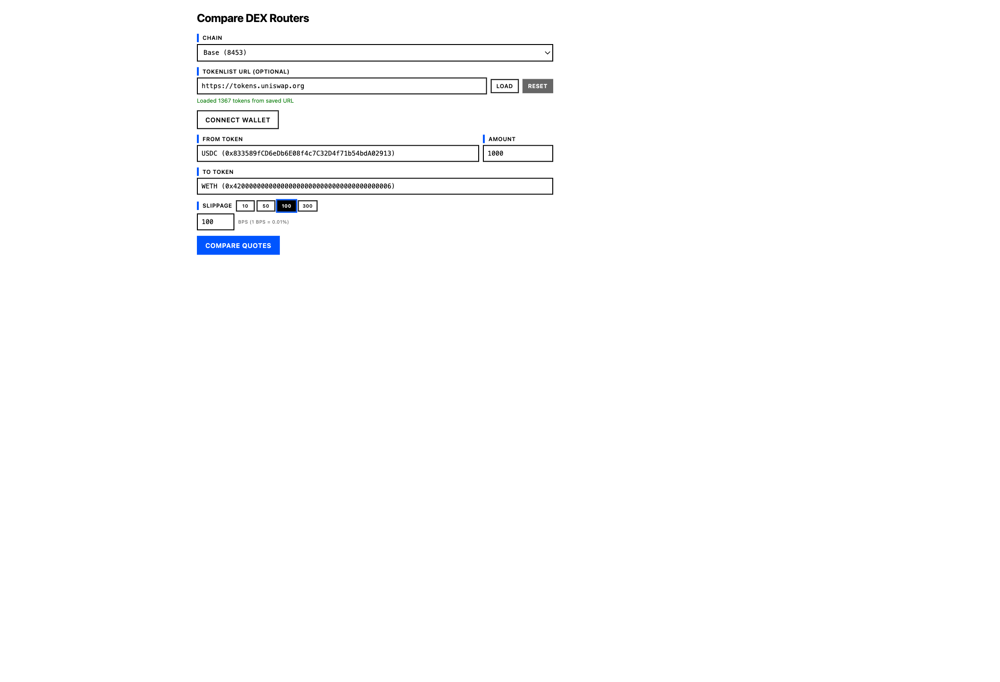

> **WARNING: This is a vibe coded prototype. Use at your own risk.**

# compare-dex-routers

A DEX router comparison and swap execution tool. Queries multiple swap routers ([Spandex](https://www.spandex.exchange/) and Curve Finance) for side-by-side quote comparison, then lets you execute the winning trade directly from the browser. Spandex aggregates across 0x, Fabric, KyberSwap, Odos, LiFi, Relay, and Velora. Includes a built-in web UI with wallet connection, token autocomplete, auto-refreshing quotes, and gas-adjusted recommendations.



## Quick start

```sh
cp env.example .env   # fill in ALCHEMY_API_KEY
npm install
npm run dev           # starts server at http://localhost:3000
```

Open `http://localhost:3000` in a browser to use the UI.

## Features

**Token selection** — Autocomplete powered by a local tokenlist (`data/tokenlist.json`). Filters by the selected chain, shows token logos, and accepts name, symbol, or address. After selection the input displays `SYMBOL (0xABCD…1234)`.

**Wallet connection** — Detects wallets via ERC-6963 multi-provider discovery with `window.ethereum` fallback. Connect/disconnect with one click; the sender address auto-fills into the quote form.

**Swap execution** — Approve and Swap buttons appear on each quote. Uses raw EIP-1193 provider calls. Handles chain switching when the wallet is on the wrong network and shows transaction status (pending → confirmed / failed).

**Auto-refresh** — Quotes re-fetch every 15 seconds with a visible countdown. Refreshing pauses while a transaction is in flight and resumes after it completes or fails.

**Gas-adjusted comparison** — The recommendation factors in gas costs when available. For ETH/WETH swaps, gas-adjusted output amounts are shown so you can compare net value received.

**MEV protection guidance** — An info button on the quote form opens a modal with chain-specific MEV advice: Flashbots Protect for Ethereum, bloXroute for BSC, and sequencer details for L2 chains.

**Brutalist design** — High-contrast black/white with a `#0055FF` blue accent. Color-blind-safe, no border-radius. Inline results with collapsible details.

## Tokenlist

Token autocomplete reads from `data/tokenlist.json`, served by the `GET /tokenlist` endpoint. You can replace this file with your own [Uniswap-format tokenlist](https://tokenlists.org/) to customize available tokens.

## Supported chains

| Chain     | ID    |
| --------- | ----- |
| Ethereum  | 1     |
| Base      | 8453  |
| Arbitrum  | 42161 |
| Optimism  | 10    |
| Polygon   | 137   |
| BSC       | 56    |
| Avalanche | 43114 |

## API

### `GET /compare`

Compare quotes from multiple routers (Spandex and Curve) side-by-side.

| Param        | Required | Description                                |
| ------------ | -------- | ------------------------------------------ |
| `chainId`    | yes      | Chain ID (see table above)                 |
| `from`       | yes      | Input token address                        |
| `to`         | yes      | Output token address                       |
| `amount`     | yes      | Human-readable input amount (e.g. `1000`)  |
| `slippageBps`| no       | Slippage tolerance in basis points (default `50`) |
| `sender`     | no       | Sender address for approval checks         |

### `GET /quote`

Single quote from the Spandex router. Same parameters as `/compare`.

### `GET /tokenlist`

Returns the contents of `data/tokenlist.json`.

### `GET /chains`

Returns the list of supported chains.

### `GET /health`

Health check endpoint.

### `GET /metrics`

Prometheus-compatible metrics (enabled via `METRICS_ENABLED`).

### `GET /`

Interactive web UI.

## Environment variables

Copy `env.example` to `.env` and fill in your keys.

| Variable          | Required | Description                                  |
| ----------------- | -------- | -------------------------------------------- |
| `ALCHEMY_API_KEY` | yes      | Alchemy API key for RPC access               |
| `ZEROX_API_KEY`   | no       | 0x API key                                   |
| `FABRIC_API_KEY`  | no       | Fabric API key                               |
| `RPC_URL_<id>`    | no       | Per-chain RPC override (e.g. `RPC_URL_8453`) |
| `CURVE_ENABLED`   | no       | Enable Curve Finance quotes                  |
| `COMPARE_ENABLED` | no       | Enable the `/compare` endpoint               |
| `METRICS_ENABLED` | no       | Enable the `/metrics` endpoint               |
| `SENTRY_DSN`      | no       | Sentry DSN for error tracking                |
| `LOG_LEVEL`       | no       | Log level (default `info`)                   |

## Development

```sh
npm run dev             # dev server with file watch
npm run typecheck       # type-check without emitting
npm run lint            # lint with ESLint
npm run lint:fix        # lint and auto-fix
npm run format          # format with Prettier
npm test                # run tests (Vitest)
npm run test:coverage   # tests with coverage
```

## Production

```sh
npm start
```

Or with Docker:

```sh
docker compose up --build -d
docker compose down       # to stop
```
