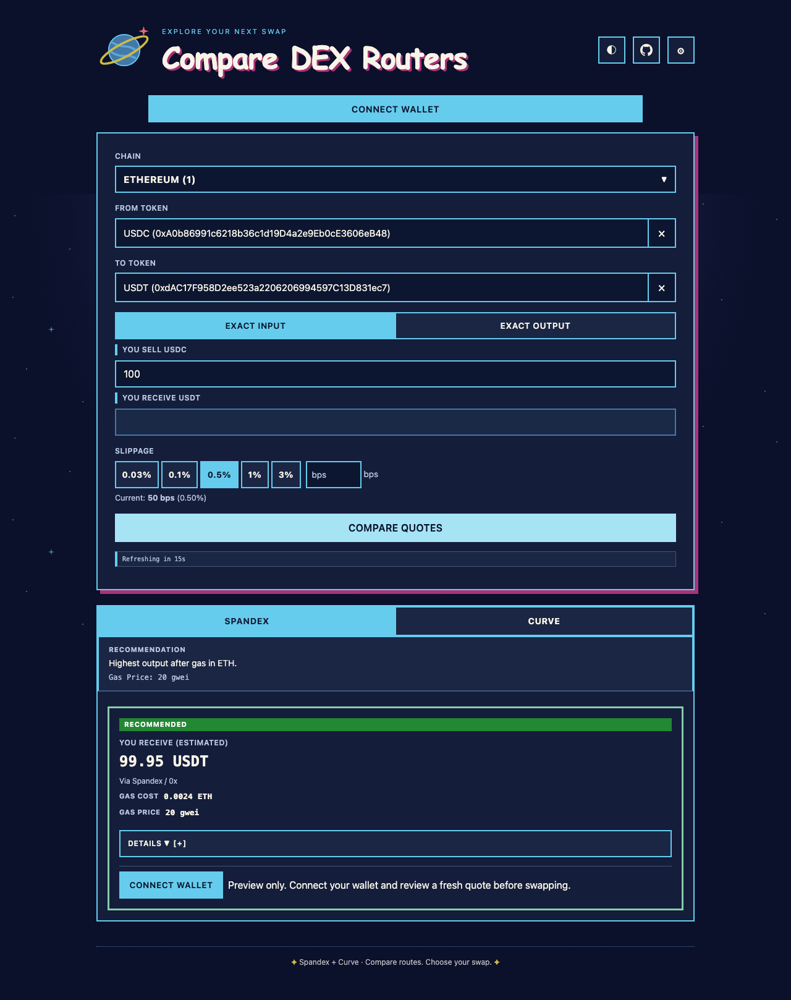

> **WARNING: This is a vibe coded prototype. Use at your own risk.**

# compare-dex-routers

Compare swap quotes from [Spandex](https://www.spandex.exchange/) and Curve Finance side by side, then execute the winning trade from the browser. Spandex aggregates across 0x, Fabric, KyberSwap, Nordstern, LiFi, Relay, and Velora. Curve covers all 7 supported chains.



## Quick start

Use Node.js 24.21.0, pnpm 12.3.1, and Bun 1.4.0. Bun builds the pinned Spandex Git dependency during installation. Docker and CI install these versions.

```sh
cp env.example .env   # set RPC_URL_<chainId> or ALCHEMY_API_KEY
pnpm install
pnpm run dev           # starts API at :3100 and frontend at :5173
```

Open `http://localhost:5173` to use the UI. The API defaults to port 3100. If `.env` sets `PORT`, the Vite proxy uses that port.

## Features

- Searchable chain selector (filter by name or chain ID)
- Token autocomplete from built-in and custom tokenlists, with source labels when symbols collide
- Wallet connection via ERC-6963 discovery with `window.ethereum` fallback
- Approve + Swap flow with chain switching and transaction status tracking
- Auto-refreshing quotes (15s countdown, pauses during transactions)
- Server recommendation from token amounts, simulated gas use, and chain-native RPC gas prices
- MEV protection guidance (Flashbots Protect on Ethereum, sequencer details on L2s)
- Slippage presets (10, 50, 100, 300 bps) plus custom input
- Clear (X) button on token inputs to quickly reset selections
- Duplicate token guard — selecting the same token in both fields swaps them automatically
- Brutalist black/white design with WCAG AA color accents
- Full addresses everywhere, no truncation (responsive font sizing via CSS `clamp()`)

## Tokenlist management

Token autocomplete reads from `packages/api/static/tokenlist.json` plus any custom remote tokenlists you add via the settings panel.

- Add custom tokenlist URLs (fetched directly from the browser)
- Toggle individual lists on/off; URLs and toggle states persist in `localStorage`
- Chain mismatch warnings when a list has no tokens for the selected chain
- Paste an unknown contract address to trigger on-chain ERC-20 metadata lookup, then save to your local token list
- Export/import local tokens as [Uniswap-format tokenlist](https://tokenlists.org/) JSON
- Trust warning for custom tokenlist sources
- Unavailable custom lists remain saved for the next startup

## Supported chains

| Chain     | ID    |
| --------- | ----- |
| Ethereum  | 1     |
| Base      | 8453  |
| Arbitrum  | 42161 |
| Optimism  | 10    |
| Polygon   | 137   |
| BSC       | 56    |
| Avalanche | 43114 |

## API

### `GET /compare`

Compare quotes from Spandex and Curve in one response. The browser calls `/api/compare`; direct API requests use `/compare`. Both Compose files and Vite strip the `/api` prefix.

| Param         | Required | Description                                                                          |
| ------------- | -------- | ------------------------------------------------------------------------------------ |
| `chainId`     | yes      | Chain ID (see table above)                                                           |
| `from`        | yes      | Input token address                                                                  |
| `to`          | yes      | Output token address                                                                 |
| `amount`      | yes      | Human-readable input for `exactIn`, desired output for `targetOut`                   |
| `slippageBps` | no       | Slippage tolerance in basis points (default `50`)                                    |
| `sender`      | no       | Account used to build and simulate execution data; omit for a non-executable preview |

| `mode` | no | `exactIn` (default) or `targetOut` |

`/compare` returns `spandex`, `curve`, provider errors, and `recommendation`, `recommendation_reason`, and `recommendation_basis`. Both router results use the same `Quote` schema. It includes raw decimal amount strings, a nullable route graph, chain-native gas fields, and nullable `execution: { to, data, value, approval }`. `execution` is null without a sender. Only quotes with successful simulations can provide execution data.

The recommendation compares values after gas when both routes have gas and conversion data. Otherwise, it compares raw amounts and states this in the result. Polygon uses POL, BSC uses BNB, and Avalanche uses AVAX. `targetOut` is an output target; the returned output remains an estimate.

Changing a token, amount, mode, slippage, chain, account, or wallet invalidates displayed quotes. Approval state belongs to the chain, account, token, spender, and required input amount. The app checks the wallet context again before each transaction. It submits transactions through the connected wallet RPC. Configure private RPC protection in the wallet; the app does not sign or submit Flashbots raw transactions.

See `/api/docs` for the complete contract. Run `pnpm run generate:types` after a schema change.

### `GET /quote`

Single quote from the Spandex router. Same parameters and `Quote` schema as `/compare`. `/quote-curve` selects Curve.

### `GET /tokenlist`

Returns the contents of `packages/api/static/tokenlist.json`.

### `GET /token-metadata`

Looks up on-chain ERC-20 metadata for a given token address. Used by the UI for unrecognized token detection.

| Param     | Required | Description                |
| --------- | -------- | -------------------------- |
| `chainId` | yes      | Chain ID (see table above) |
| `address` | yes      | Token contract address     |

### `GET /chains`

Returns the list of supported chains.

### `GET /health`

Health check endpoint.

### `GET /metrics`

Prometheus-compatible metrics (enabled via `METRICS_ENABLED`).

### `GET /`

Interactive web UI.

## Environment variables

Copy `env.example` to `.env` and fill in your keys.

| Variable          | Required    | Description                                     |
| ----------------- | ----------- | ----------------------------------------------- |
| `ALCHEMY_API_KEY` | conditional | Required only for chains without `RPC_URL_<id>` |
| `ZEROX_API_KEY`   | no          | 0x API key                                      |
| `FABRIC_API_KEY`  | no          | Fabric API key                                  |
| `RPC_URL_<id>`    | no          | Per-chain RPC override (e.g. `RPC_URL_8453`)    |
| `CURVE_ENABLED`   | no          | Enable Curve Finance quotes (all 7 chains)      |
| `COMPARE_ENABLED` | no          | Enable the `/compare` endpoint                  |
| `METRICS_ENABLED` | no          | Enable the `/metrics` endpoint                  |
| `SENTRY_DSN`      | no          | Sentry DSN for error tracking                   |
| `LOG_LEVEL`       | no          | Log level (default `info`)                      |

## Dependency builds

The app pins `SatoshiAndKin/spandex` at `04db5f3d814ad55fc740ef519ec347c9c6cec165`, based on upstream 0.11.0 with the Curve adapter restored. The package builds its ESM, CommonJS, and type exports with `prepack`. `pnpm-workspace.yaml` permits the build only for this exact Git package. Update the pin and build allowlist together. No local module aliases or dependency export overrides are required.

The workspace retains its seven-day release age policy and strict build allowlist. `js-yaml@4.3.1` is overridden to the patched 4.3.2 because a transitive generator dependency pins the affected version. TypeScript stays within the supported ranges of the Svelte, ESLint, and OpenAPI tools.

## Development

All commands run from the repo root and delegate to workspaces (`packages/api`, `packages/frontend`).

```sh
pnpm run dev             # dev server with file watch
pnpm run typecheck       # type-check without emitting
pnpm run lint            # lint with ESLint
pnpm run lint:fix        # lint and auto-fix
pnpm run format          # format with Prettier
pnpm test                # run tests (Vitest)
pnpm run test:coverage   # tests with coverage
```

## Production

```sh
cd packages/api && pnpm start    # API server
cd packages/frontend && pnpm run build && pnpm run preview  # Frontend
```

Or with Docker:

```sh
docker compose up --build -d
docker compose down       # to stop
```

### Zero-downtime deploys

Uses [docker-rollout](https://github.com/Wowu/docker-rollout) with Traefik for zero-downtime rolling deployments. See `scripts/deploy.sh`.

### Subtree Synchronization

The `traefik-proxy` directory is managed as a git subtree. To sync changes with the upstream repository:

**Pull latest changes from upstream:**

```bash
git subtree pull --prefix traefik-proxy git@github.com:SatoshiAndKin/traefik-proxy.git main --squash
```

**Push local changes to upstream:**

```bash
git subtree push --prefix traefik-proxy git@github.com:SatoshiAndKin/traefik-proxy.git main
```
